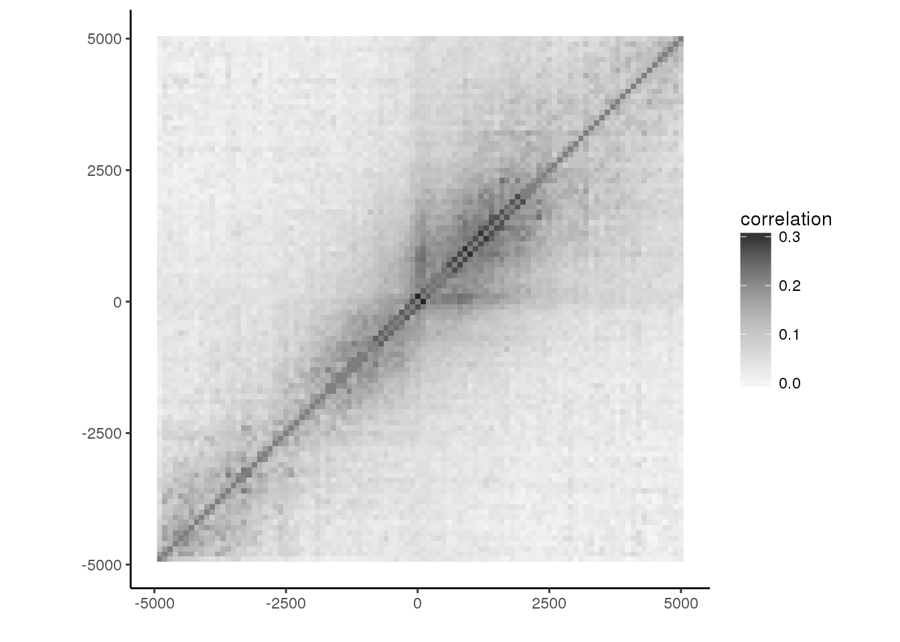
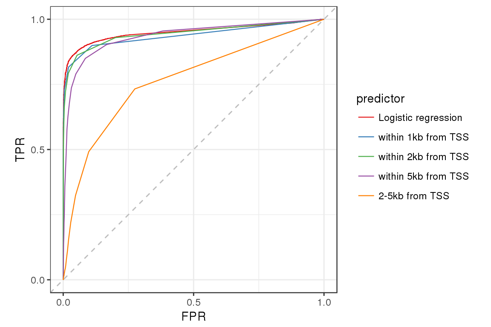

# Optimal resolution of ChILT

*by determining the effective range ChILT-H3K4me3(#3) for ChIP-seq peak prediction*

### Setup


```r
library(ggplot2)
library(dplyr)
library(data.table)
library(dtplyr)
library(Matrix)
source("RScripts/myROC.R")
gx <- function(x,mu=0,sigma=20) dnorm(x-0.5,mu,sigma)
tablemd <- function(x,...) knitr::kable(x,format="markdown",...)
```


```r
print(sessionInfo(),locale=FALSE)
```

```
## R version 3.3.2 (2016-10-31)
## Platform: x86_64-pc-linux-gnu (64-bit)
## 
## attached base packages:
## [1] stats     graphics  grDevices utils     datasets  methods   base     
## 
## other attached packages:
## [1] Matrix_1.2-11     dtplyr_0.0.2      data.table_1.10.4 dplyr_0.7.3      
## [5] ggplot2_2.2.1    
## 
## loaded via a namespace (and not attached):
##  [1] Rcpp_0.12.12     bindr_0.1        knitr_1.17       magrittr_1.5    
##  [5] munsell_0.4.3    lattice_0.20-35  colorspace_1.3-2 R6_2.2.2        
##  [9] rlang_0.1.2      stringr_1.2.0    plyr_1.8.4       tools_3.3.2     
## [13] grid_3.3.2       gtable_0.2.0     htmltools_0.3.6  yaml_2.1.14     
## [17] lazyeval_0.2.0   rprojroot_1.2    digest_0.6.12    assertthat_0.2.0
## [21] tibble_1.3.4     bindrcpp_0.2     glue_1.1.1       evaluate_0.10.1 
## [25] rmarkdown_1.6    stringi_1.1.5    scales_0.5.0     backports_1.1.0 
## [29] pkgconfig_2.0.1
```

### Load data


```r
wr <- seq(-5000,5000)
# Gaussian smoothing matrix
G <- drop0(t(sapply(wr,function(mu) gx(wr,mu,20))),1e-8)
X <- fread("zcat < data/aggrTSS_H3K4me3-1_5cnt.txt.gz") %>%
  dplyr::select(-1) %>% as.matrix %>% Matrix
```

```
## 
Read 0.0% of 10001 rows
Read 100.0% of 10001 rows
Read 10001 rows and 27052 (of 27052) columns from 1.008 GB file in 00:00:17
```

```r
peak <- fread("zcat < data/ensembl_grcm38_refseqNM_uniqENST_coding_eH3K4me3PeakCountTSSwithin1000.txt.gz")
```

### Predict ChIP-seq peaks by ChILT signal count (bins at TSSs)

The model consists of

* Response: existence of peaks (0: absent, 1: present)
* Predictors: counts of bins around a TSS

of all protein-coding genes.


```r
# 100 bins at TSS
br <- cut(seq(-5,5,by=0.001),100,include.lowest = TRUE,right = FALSE)
Xb <- simplify2array(by(as.matrix(X),br,colSums))
```

#### Inspect correlations of bins


```r
R <- cor(Xb)
diag(R) <- NA
reshape2::melt(R,value.name="correlation") %>%
  mutate_at(1:2, function(x) 100*(as.integer(x)-50)) %>%
  ggplot(aes(Var1,Var2,fill=correlation)) +
  geom_raster() + coord_fixed() + 
  scale_fill_distiller(palette="Greys",direction=1) +
  theme_classic() + xlab("") + ylab("")
```

<!-- -->


```r
model <- glm((peak$V7>0)~Xb,family=binomial,control = list(maxit=100,trace = TRUE))
```

```
## Deviance = 22995.72 Iterations - 1
## Deviance = 18256.85 Iterations - 2
## Deviance = 15293.07 Iterations - 3
## Deviance = 13642.13 Iterations - 4
## Deviance = 12999.54 Iterations - 5
## Deviance = 12886.84 Iterations - 6
## Deviance = 12882.89 Iterations - 7
## Deviance = 12882.88 Iterations - 8
## Deviance = 12882.88 Iterations - 9
```

```
## Warning: glm.fit: fitted probabilities numerically 0 or 1 occurred
```

```r
xs <- G%*%Matrix::rowSums(X)
plot(seq(-5000,5000,len=100),coef(model)[-1],type="h",lwd=4,pch=20,
     col=ifelse(summary(model)$coef[-1,4] < 0.01,"red","grey"))
lines(seq(-5000,5000),xs/max(xs)*max(coef(model)[-1]),lwd=2)
abline(h=0,v=0,lty=2)
```

<!-- -->

### Performances of each bin-size


```r
pdata <- cbind(
  `Logistic regression` = predict(model,type = "response"),
  `within 1kb from TSS` = Matrix::colSums(X[seq(-1000,1000)+5001,]),
  `within 2kb from TSS` = Matrix::colSums(X[seq(-2000,2000)+5001,]),
  `within 5kb from TSS` = Matrix::colSums(X[seq(-5000,5000)+5001,]),
  `2-5kb from TSS` = Matrix::colSums(X[-c(seq(-2000,2000)+5001),])
)
  
plotROCs(pdata, as.logical(model$y), pts=FALSE) +
    geom_abline(colour="grey",linetype=2) +
    coord_fixed() + scale_color_brewer(palette="Set1") + theme_bw()
```

<!-- -->


```r
for(i in colnames(pdata)){
  cat(paste("####",i))
  tableTPFP(pdata[,i],model$y==1) %>% arrange(-Jaccard) %>%
  head(10) %>% round(3) %>% tablemd %>% print
  cat(fill=TRUE)
}
```

#### Logistic regression

| threshold|  FP|    TP|   FN|    TN|   TPR|   FPR|    YJ| Jaccard|
|---------:|---:|-----:|----:|-----:|-----:|-----:|-----:|-------:|
|     0.415| 791| 12553| 1643| 12064| 0.884| 0.062| 0.823|   0.838|
|     0.418| 788| 12550| 1646| 12067| 0.884| 0.061| 0.823|   0.838|
|     0.415| 791| 12552| 1644| 12064| 0.884| 0.062| 0.823|   0.838|
|     0.417| 790| 12551| 1645| 12065| 0.884| 0.061| 0.823|   0.838|
|     0.414| 796| 12556| 1640| 12059| 0.884| 0.062| 0.823|   0.838|
|     0.418| 789| 12550| 1646| 12066| 0.884| 0.061| 0.823|   0.838|
|     0.414| 795| 12555| 1641| 12060| 0.884| 0.062| 0.823|   0.838|
|     0.440| 731| 12501| 1695| 12124| 0.881| 0.057| 0.824|   0.837|
|     0.411| 798| 12557| 1639| 12057| 0.885| 0.062| 0.822|   0.837|
|     0.415| 791| 12551| 1645| 12064| 0.884| 0.062| 0.823|   0.837|

#### within 1kb from TSS

| threshold|    FP|    TP|   FN|    TN|   TPR|   FPR|    YJ| Jaccard|
|---------:|-----:|-----:|----:|-----:|-----:|-----:|-----:|-------:|
|         1|  1421| 12765| 1431| 11434| 0.899| 0.111| 0.789|   0.817|
|         2|   264| 11589| 2607| 12591| 0.816| 0.021| 0.796|   0.801|
|         3|    58| 10353| 3843| 12797| 0.729| 0.005| 0.725|   0.726|
|         4|    22|  9129| 5067| 12833| 0.643| 0.002| 0.641|   0.642|
|         5|     9|  8002| 6194| 12846| 0.564| 0.001| 0.563|   0.563|
|         0| 12855| 14196|    0|     0| 1.000| 1.000| 0.000|   0.525|
|         6|     3|  6923| 7273| 12852| 0.488| 0.000| 0.487|   0.488|
|         7|     1|  5922| 8274| 12854| 0.417| 0.000| 0.417|   0.417|
|         8|     0|  4996| 9200| 12855| 0.352| 0.000| 0.352|   0.352|
|         9|     0|  4225| 9971| 12855| 0.298| 0.000| 0.298|   0.298|

#### within 2kb from TSS

| threshold|    FP|    TP|   FN|    TN|   TPR|   FPR|    YJ| Jaccard|
|---------:|-----:|-----:|----:|-----:|-----:|-----:|-----:|-------:|
|         2|   682| 12234| 1962| 12173| 0.862| 0.053| 0.809|   0.822|
|         1|  2572| 13195| 1001| 10283| 0.929| 0.200| 0.729|   0.787|
|         3|   254| 11257| 2939| 12601| 0.793| 0.020| 0.773|   0.779|
|         4|   114| 10267| 3929| 12741| 0.723| 0.009| 0.714|   0.717|
|         5|    54|  9402| 4794| 12801| 0.662| 0.004| 0.658|   0.660|
|         6|    32|  8517| 5679| 12823| 0.600| 0.002| 0.597|   0.599|
|         7|    18|  7696| 6500| 12837| 0.542| 0.001| 0.541|   0.541|
|         0| 12855| 14196|    0|     0| 1.000| 1.000| 0.000|   0.525|
|         8|    10|  6901| 7295| 12845| 0.486| 0.001| 0.485|   0.486|
|         9|     7|  6152| 8044| 12848| 0.433| 0.001| 0.433|   0.433|

#### within 5kb from TSS

| threshold|    FP|    TP|   FN|    TN|   TPR|   FPR|    YJ| Jaccard|
|---------:|-----:|-----:|----:|-----:|-----:|-----:|-----:|-------:|
|         3|  1093| 12065| 2131| 11762| 0.850| 0.085| 0.765|   0.789|
|         2|  2139| 12816| 1380| 10716| 0.903| 0.166| 0.736|   0.785|
|         4|   622| 11212| 2984| 12233| 0.790| 0.048| 0.741|   0.757|
|         5|   403| 10453| 3743| 12452| 0.736| 0.031| 0.705|   0.716|
|         1|  4918| 13559|  637|  7937| 0.955| 0.383| 0.573|   0.709|
|         6|   308|  9657| 4539| 12547| 0.680| 0.024| 0.656|   0.666|
|         7|   234|  8901| 5295| 12621| 0.627| 0.018| 0.609|   0.617|
|         8|   186|  8205| 5991| 12669| 0.578| 0.014| 0.564|   0.571|
|         0| 12855| 14196|    0|     0| 1.000| 1.000| 0.000|   0.525|
|         9|   166|  7519| 6677| 12689| 0.530| 0.013| 0.517|   0.524|

#### 2-5kb from TSS

| threshold|    FP|    TP|    FN|    TN|   TPR|   FPR|    YJ| Jaccard|
|---------:|-----:|-----:|-----:|-----:|-----:|-----:|-----:|-------:|
|         1|  3529| 10399|  3797|  9326| 0.733| 0.275| 0.458|   0.587|
|         0| 12855| 14196|     0|     0| 1.000| 1.000| 0.000|   0.525|
|         2|  1259|  6980|  7216| 11596| 0.492| 0.098| 0.394|   0.452|
|         3|   607|  4593|  9603| 12248| 0.324| 0.047| 0.276|   0.310|
|         4|   370|  3113| 11083| 12485| 0.219| 0.029| 0.191|   0.214|
|         5|   262|  2164| 12032| 12593| 0.152| 0.020| 0.132|   0.150|
|         6|   212|  1596| 12600| 12643| 0.112| 0.016| 0.096|   0.111|
|         7|   166|  1191| 13005| 12689| 0.084| 0.013| 0.071|   0.083|
|         8|   139|   928| 13268| 12716| 0.065| 0.011| 0.055|   0.065|
|         9|   121|   742| 13454| 12734| 0.052| 0.009| 0.043|   0.052|

